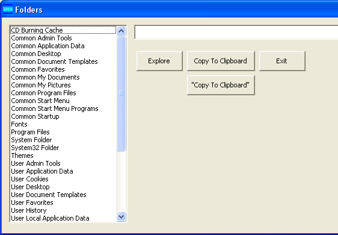



## Special Folders

### Description

Ever wonder about the special folders in Windows XP or Vista? Folders like the user data, CD burning cache, and others? This program will get the actual paths to these folders, and you can explore the folder or copy the path to the clipboard.
 
### More Info
 

             |
---                |---
**Submitted On**   |2007-02-18 22:26:40
**By**             |[Charles Kistler](https://github.com/Planet-Source-Code/PSCIndex/blob/master/ByAuthor/charles-kistler.md)
**Level**          |Beginner
**User Rating**    |5.0 (25 globes from 5 users)
**Compatibility**  |VB 6\.0
**Category**       |[Miscellaneous](https://github.com/Planet-Source-Code/PSCIndex/blob/master/ByCategory/miscellaneous__1-1.md)
**World**          |[Visual Basic](https://github.com/Planet-Source-Code/PSCIndex/blob/master/ByWorld/visual-basic.md)
**Archive File**   |[Special\_Fo2048642182007\.zip](https://github.com/Planet-Source-Code/charles-kistler-special-folders__1-67905/archive/master.zip)

